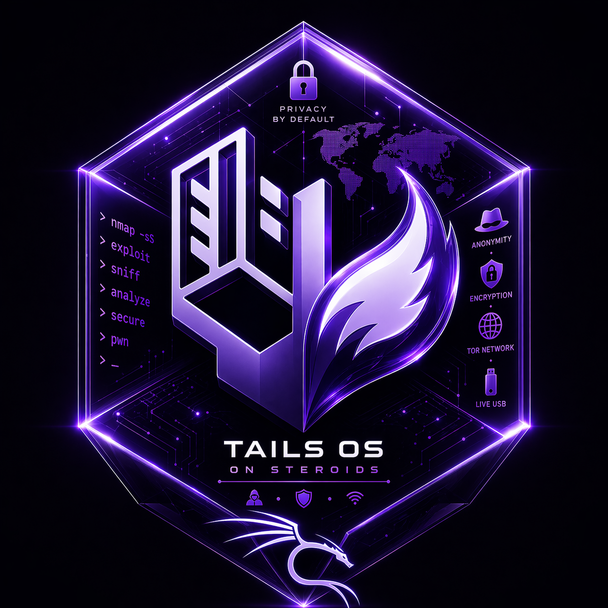

<div align="center">



# 👻 T O S S
### *Tails OS on Steroids*

> **"Privacy is not a feature. It's the foundation. The weapons come after."**

[](LICENSE)
[](https://tails.boum.org/)
[](https://www.gnu.org/software/bash/)
[](https://github.com/)
[](https://www.torproject.org/)
[]()

```
████████╗ █████╗ ██╗██╗      ███████╗     ██████╗ ███╗   ██╗
╚══██╔══╝██╔══██╗██║██║      ██╔════╝    ██╔═══██╗████╗  ██║
   ██║   ███████║██║██║      ███████╗    ██║   ██║██╔██╗ ██║
   ██║   ██╔══██║██║██║      ╚════██║    ██║   ██║██║╚██╗██║
   ██║   ██║  ██║██║███████╗ ███████║    ╚██████╔╝██║ ╚████║
   ╚═╝   ╚═╝  ╚═╝╚═╝╚══════╝ ╚══════╝     ╚═════╝ ╚═╝  ╚═══╝

███████╗████████╗███████╗██████╗  ██████╗ ██╗██████╗ ███████╗
██╔════╝╚══██╔══╝██╔════╝██╔══██╗██╔═══██╗██║██╔══██╗██╔════╝
███████╗   ██║   █████╗  ██████╔╝██║   ██║██║██║  ██║███████╗
╚════██║   ██║   ██╔══╝  ██╔══██╗██║   ██║██║██║  ██║╚════██║
███████║   ██║   ███████╗██║  ██║╚██████╔╝██║██████╔╝███████║
╚══════╝   ╚═╝   ╚══════╝╚═╝  ╚═╝ ╚═════╝ ╚═╝╚═════╝ ╚══════╝
```

**Boot. Arm. Hack. Reboot. Vanish.**

</div>

---

## 🧬 What Is TOSS?

**TOSS** is a single bash script that transforms a live [Tails OS](https://tails.boum.org/) session into a fully-armed, anonymous penetration testing platform — in minutes.

Tails already gives you the most privacy-hardened operating environment on Earth. TOSS gives it teeth.

It presents a clean, categorised interactive menu to install 50+ of the world's most powerful offensive security tools — across recon, exploitation, web attacks, network attacks, post-exploitation, and C2 — all running inside an amnesic live session that leaves **zero forensic trace** the moment you reboot.

No persistent installation. No modified ISO. No traces on disk. Just a USB, a script, and the job.

```
┌─────────────────────────────────────────────────────────┐
│ Boot Tails → Run TOSS → Hack │
│ Reboot → Session wiped → You were never here. │
└─────────────────────────────────────────────────────────┘
```

---

## 🔐 Tails OS — What It Gives You (And What It Doesn't)

Understanding Tails is critical to understanding why TOSS exists.

### ✅ What Tails Provides Out of the Box

| Feature | Detail |
|---|---|
| **Amnesic System** | Every session starts from a clean slate. RAM is wiped on shutdown. Nothing is written to the host machine — ever. |
| **Tor-Only Networking** | 100% of traffic — DNS, HTTP, application-level — is forced through the Tor anonymity network. Direct clearnet connections are blocked at the kernel level. |
| **No Swap Space** | RAM is never paged to disk. Your active session data never touches any storage medium. |
| **MAC Address Spoofing** | Your network card's hardware address is randomised on every boot. You appear as a different device on every network, every session. |
| **Encrypted Communications** | Ships with GnuPG, OpenPGP, and KeePassXC. Encrypted email and messaging ready out of the box. |
| **Metadata Scrubbing** | Integrated MAT2 tool strips identifying metadata from documents, images, and files before you share them. |
| **Hardened Browser** | Tor Browser with advanced fingerprinting protection, uBlock Origin, and first-party isolation. You look like every other Tor user — indistinguishable. |
| **Persistent Storage (Optional)** | LUKS-encrypted volume on the USB for saving specific files across sessions — disabled and deniable by default. |
| **Physical Isolation** | Tails ignores the host machine's internal drives entirely. It cannot accidentally read from or write to the host OS. |
| **Hardened Kernel** | Linux kernel with significant attack surface reduction — no unused modules, restrictive syscall filtering. |
| **Secure Memory Wipe** | On shutdown, Tails overwrites RAM to prevent cold-boot attacks. |

### ❌ What Tails Lacks — The TOSS Gap

Tails is built for **journalists, whistleblowers, activists, and privacy-conscious civilians** — not penetration testers. It is hardened for defence, not offence. Out of the box, it ships with:

- ❌ No port scanners or network mapping tools
- ❌ No exploitation frameworks (no Metasploit, no SearchSploit)
- ❌ No web fuzzing, injection, or brute-force tools
- ❌ No OSINT or reconnaissance tooling
- ❌ No vulnerability scanners
- ❌ No packet crafting or MITM tools beyond basic Wireshark
- ❌ No C2 frameworks
- ❌ No post-exploitation or privilege escalation tools
- ❌ No subdomain enumeration, directory busting, or credential dumping
- ❌ No social media intelligence tools

**The result: you have the world's most private operating system with zero offensive capability.**

TOSS fills every one of those gaps — without touching the USB, without writing to disk, and without breaking a single one of Tails' privacy guarantees.

---

## ⚔️ What TOSS Does to Tails

TOSS does not modify Tails. It does not touch the USB drive. It does not write to disk.

It installs everything **directly into the live session's RAM**. Tools exist for the duration of your session. The moment you reboot, the entire arsenal disappears — completely and irreversibly.

```
┌──────────────────── STANDARD TAILS ─────────────────────────┐
│ ✅ Anonymous ✅ Untraceable ❌ Unarmed │
│ ✅ Tor-Routed ✅ Amnesic ❌ No Pentest Tools │
│ ✅ MAC Spoofed ✅ No Disk Trace ❌ No Exploitation │
└─────────────────────────────────────────────────────────────┘
+
┌──────────────────── TOSS ─────────────────────────────┐
│ 50+ Offensive Security Tools | 6 Attack Categories │
│ Recon → Vuln Scan → Exploit → Web → Network → Post-Exploit │
│ Installed entirely in RAM | Tor-Routed Downloads │
│ Zero persistence | Zero forensic trace │
└─────────────────────────────────────────────────────────────┘
=
┌──────────────────── TOSS SESSION ─────────────────────┐
│ ✅ Anonymous ✅ Untraceable ✅ Fully Armed │
│ ✅ Tor-Routed ✅ Amnesic ✅ Engagement-Ready │
│ ✅ MAC Spoofed ✅ No Disk Trace ✅ Zero Persistence │
│ ✅ RAM-Only ✅ No Logs ✅ Ghost Mode │
└─────────────────────────────────────────────────────────────┘
```

This is effectively Kali Linux's toolset running inside a ghost — it exists only while you need it, then it vanishes completely.

---

## 🚀 Quick Start

```bash
# Step 1 — Create your Tails USB
# Download from https://tails.boum.org and flash to USB with Balena Etcher

# Step 2 — Boot into Tails
# At the Tails Greeter, set an Admin Password — this is required for sudo

# Step 3 — Open Terminal and clone TOSS
git clone https://github.com/yourusername/TOSS.git
cd TOSS

# Step 4 — Make executable and launch
chmod +x TOSS.sh
sudo ./TOSS.sh
```

> 🐢 **Speed Note:** All downloads are routed through Tor by Tails. Expect 2–5x slower download speeds compared to a clearnet connection. This is intentional — your anonymity is non-negotiable. Sit back.

> 💡 **No git on fresh Tails?** Run `sudo apt install git -y` first.

---

## 📦 Full Arsenal — Tool Index

### 🔍 Category 1 · Reconnaissance

<details>
<summary><b>🕵️ Passive OSINT & Info Gathering</b></summary>

| Tool | Purpose |
|---|---|
| `theHarvester` | Email, subdomain, and hostname enumeration from public sources |
| `SpiderFoot` | Automated OSINT with 200+ module data sources |
| `Metagoofil` | Extracts metadata from publicly available documents |
| `ExifTool` | Deep metadata extraction from images, PDFs, Office files |
| `Sherlock` | Find a username across 300+ social media platforms instantly |

</details>

<details>
<summary><b>🌐 DNS, Subdomain Enumeration & Google Dorking</b></summary>

| Tool | Purpose |
|---|---|
| `Amass` | In-depth attack surface mapping via passive/active DNS |
| `Sublist3r` | Fast subdomain enumeration via multiple OSINT sources |
| `Assetfinder` | Quick subdomain and asset discovery for a target domain |
| `Findomain` | Cross-platform subdomain finder with monitoring capability |
| `Subfinder` | Passive subdomain discovery at scale — Projectdiscovery |
| `Pagodo` | Automated Google dorking for sensitive data exposure |
| `Chaos` | Passive subdomain intelligence from Projectdiscovery datasets |

</details>

<details>
<summary><b>📡 Active Network & Web Recon</b></summary>

| Tool | Purpose |
|---|---|
| `Nmap` | Gold standard in network discovery and port scanning |
| `Masscan` | Scan the entire internet in under 6 minutes |
| `Whatweb` | Fingerprint web technology stacks and CMS platforms |
| `Wafw00f` | Web Application Firewall detection and fingerprinting |
| `Netdiscover` | Active/passive network address discovery via ARP |
| `Arp-scan` | ARP-layer host discovery on local networks |
| `DNSrecon` | DNS enumeration, zone transfers, and brute-force |
| `Fierce` | DNS reconnaissance tool for non-contiguous IP spaces |
| `Gobuster` | URI, DNS, and vHost brute-forcing at speed |
| `MassDNS` | High-performance DNS resolver for bulk domain lookups |
| `Gospider` | Fast web spider for link extraction and crawling |
| `Hakrawler` | Simple, fast web crawler designed for endpoint discovery |
| `Katana` | Next-gen web crawling and spidering framework |
| `Paramspider` | Mine URLs with parameters from web archives |
| `AIODNSBrute` | Async, high-concurrency DNS brute-forcing |

</details>

<details>
<summary><b>📲 Social Media OSINT</b></summary>

| Tool | Purpose |
|---|---|
| `Sherlock` | Username hunting across 300+ platforms |
| `Maigret` | Deep OSINT profiling by username with per-site analysis |
| `Instaloader` | Download and analyse Instagram profiles, posts, and stories |
| `PhoneInfoga` | Advanced phone number OSINT, carrier lookup, and geolocation |
| `Holehe` | Check if an email is registered on 120+ sites |

</details>

---

### 🛡️ Category 2 · Vulnerability Scanning

<details>
<summary><b>🔬 General Vulnerability Scanners</b></summary>

| Tool | Purpose |
|---|---|
| `Nikto` | Web server misconfiguration and vulnerability scanner |
| `OpenVAS` | Full-featured open-source vulnerability management platform |
| `Nuclei` | Template-based vulnerability scanner — 5000+ community templates |
| `Wapiti` | Black-box web application vulnerability scanner |
| `Lynis` | Security auditing and hardening tool for Linux systems |

</details>

<details>
<summary><b>🧩 Web App & CMS Scanners</b></summary>

| Tool | Purpose |
|---|---|
| `OWASP ZAP` | Industry-standard integrated web app security testing proxy |
| `W3AF` | Web application attack and audit framework |
| `WPScan` | WordPress security scanner — users, plugins, themes, CVEs |
| `Droopescan` | Drupal and SilverStripe CMS vulnerability scanner |
| `Joomscan` | Joomla CMS vulnerability detection |

</details>

---

### 💣 Category 3 · Exploitation & C2

<details>
<summary><b>🎯 Exploitation Frameworks</b></summary>

| Tool | Purpose |
|---|---|
| `Metasploit Framework` | The world's most widely used penetration testing framework |
| `SearchSploit / ExploitDB` | Offline access to the world's largest public exploit database |
| `BeEF-XSS` | Browser Exploitation Framework for client-side attack campaigns |
| `SQLMap` | Automated SQL injection detection, exploitation, and DB dumping |
| `Veil` | AV-evasion payload generation for post-exploitation |

</details>

<details>
<summary><b>🕹️ Command & Control (C2) Frameworks</b></summary>

| Tool | Purpose |
|---|---|
| `Sliver` | Modern open-source C2 framework by BishopFox — mTLS, HTTP/2, DNS |
| `Merlin` | Cross-platform post-exploitation C2 using HTTP/2 |
| `PupyRAT` | Cross-platform remote access tool with full post-exploitation suite |

</details>

---

### 🌐 Category 4 · Web Application Attacks

<details>
<summary><b>💉 Injection, Fuzzing & Directory Brute-Force</b></summary>

| Tool | Purpose |
|---|---|
| `SQLMap` | Automated SQLi exploitation with full database extraction |
| `XSStrike` | Advanced XSS detection, polyglot generation, and exploitation |
| `Dalfox` | Fast parameter-based XSS scanner and exploit tool |
| `Tplmap` | Server-side template injection detection and exploitation |
| `Commix` | Automated command injection testing and exploitation |
| `WFuzz` | Web fuzzer for parameters, headers, paths, cookies, and more |
| `Dirsearch` | Fast web path scanner and directory brute-forcer |
| `DirB` | Classic, reliable web content discovery tool |
| `Feroxbuster` | Recursive, fast content discovery written in Rust |
| `FFUF` | Fuzz Faster U Fool — flexible and fast HTTP fuzzer |
| `Gobuster` | Directory, DNS, and vHost brute-force in Go |

</details>

<details>
<summary><b>🔑 Authentication Attacks</b></summary>

| Tool | Purpose |
|---|---|
| `Hydra` | Parallelised login brute-forcer supporting 50+ protocols |
| `Medusa` | Fast, modular, parallel network authentication brute-forcer |
| `CeWL` | Custom wordlist generator by spidering the target website |
| `Patator` | Modular multi-protocol brute-force tool |

</details>

---

### 📡 Category 5 · Network Attacks

<details>
<summary><b>🕸️ MITM, Sniffing & Interception</b></summary>

| Tool | Purpose |
|---|---|
| `Ettercap` | Comprehensive suite for MITM attacks on LAN |
| `Wireshark` | Deep packet inspection and protocol analysis |
| `TCPDump` | Lightweight, powerful command-line packet capture |
| `Responder` | LLMNR/NBT-NS/mDNS poisoning and NTLM credential capture |
| `Dsniff` | Network auditing and password sniffing toolkit |
| `Bettercap` | Swiss army knife for network attacks and active monitoring |
| `mitmproxy` | Interactive TLS-capable HTTP/HTTPS MITM proxy |

</details>

<details>
<summary><b>🔧 Traffic Manipulation & Packet Crafting</b></summary>

| Tool | Purpose |
|---|---|
| `Scapy` | Python-based packet crafting and network manipulation library |
| `Hping3` | TCP/IP packet assembler, analyser, and firewall tester |
| `Netcat` | The TCP/IP Swiss army knife — shells, pivots, transfers |
| `Socat` | Multipurpose bidirectional data relay and proxy |

</details>

---

### 🎯 Category 6 · Post Exploitation

<details>
<summary><b>🔀 Pivoting, Tunneling & Persistence</b></summary>

| Tool | Purpose |
|---|---|
| `SSHuttle` | Transparent VPN over SSH — pivot through compromised hosts |
| `Chisel` | Fast TCP/UDP tunnelling over HTTP with SSH authentication |
| `PupyRAT` | Full-featured post-exploitation RAT with lateral movement capabilities |

</details>

<details>
<summary><b>🐧 Linux Privilege Escalation</b></summary>

| Tool | Purpose |
|---|---|
| `LinPEAS` | Linux Privilege Escalation Awesome Script — full automated enumeration |
| `PSpy` | Monitor running processes without root — catch cron jobs, scripts, secrets |

</details>

<details>
<summary><b>🗝️ Credential Dumping & Lateral Movement</b></summary>

| Tool | Purpose |
|---|---|
| `Pypykatz` | Python implementation of Mimikatz — credential extraction without Windows |
| `Impacket` | Python library for SMB, NTLM, Kerberos, and WMI-based attacks |
| `CrackMapExec` | Swiss army knife for Active Directory environments |
| `LaZagne` | Recover passwords stored in browsers, databases, mail, memory |

</details>

---

## 🖥️ Interactive Menu Preview

```
═══════════════════════════════════════
SELECT A CATEGORY
═══════════════════════════════════════
1) Reconnaissance [Passive & Active]
2) Vulnerability Scanning [apt/go/pip]
3) Exploitation & C2 [apt/pip]
4) Web Application Attacks [go/pip/apt]
5) Network Attacks [apt/pip]
6) Post Exploitation [go/apt/pip]
A) ☠ Install ALL Categories
0) Exit
═══════════════════════════════════════

// Install ALL message:
[!] Oh wow, you clicked Install ALL. Brave. Very brave.
[*] We are now downloading half the internet onto your machine.
[*] Go make a coffee. Actually make a full meal. Maybe take a nap.
[*] Your RAM has been notified and is already crying.
[*] Tor is routing your guilt through 3 different countries.
[*] Starting in 3... 2... 1... God help us all.
```

Each category drills into a dedicated submenu — install exactly what you need for the engagement, or hit `A` and let TOSS arm everything while you brief the client.

---

## 🔒 Operational Security — Full Breakdown

TOSS inherits every one of Tails' hardened security properties. Here's the complete opsec stack:

| Layer | Tails Guarantee | TOSS Behaviour |
|---|---|---|
| **Disk Writes** | Nothing written to host machine disk | Tools install to RAM — 100% gone on reboot |
| **Network Routing** | All traffic forced through Tor, no exceptions | Tool downloads, DNS, updates all route through Tor |
| **Hardware Identity** | MAC address randomised on every boot | Appears as a different NIC on every network |
| **Memory Management** | RAM overwritten on shutdown (cold-boot protection) | No credentials, captures, or data survive power-off |
| **Swap** | No swap partition exists | Session data never paged to storage medium |
| **DNS** | DNS-over-Tor — no plaintext DNS leaks possible | Tool resolution also goes through Tor DNS |
| **Kernel** | Hardened kernel with reduced attack surface | TOSS inherits full kernel hardening |
| **Package Sources** | APT fetches via Tor-routed mirrors | All `apt install` calls use Tor-routed mirrors |
| **Command History** | No persistent shell history | Bash history dies with the RAM session |
| **System Logs** | No persistent syslog or systemd journal | Logs exist only in RAM for session duration |
| **Fingerprinting** | Tor Browser prevents browser fingerprinting | Tooling traffic indistinguishable from Tor traffic |

> 🛑 **OPSEC Reality Check:** TOSS gives you the weapons. Tails gives you the cloak. Neither protects you from **bad tradecraft**. Poor OPSEC is a human problem, not a software problem. The best tool in your arsenal is discipline.

---

## ⚙️ Requirements

| Requirement | Details |
|---|---|
| **OS** | [Tails OS](https://tails.boum.org/) — latest stable version |
| **Admin Password** | Must be configured at Tails Greeter before session starts |
| **Internet** | Active connection required — all traffic routes through Tor |
| **RAM** | 4 GB minimum · 8 GB recommended · 16 GB for full Install ALL |
| **USB Drive** | 8 GB minimum for Tails · 16 GB recommended |
| **Time** | 15–60 min depending on Tor speed and categories selected |
| **Python3 / pip3** | Pre-installed on Tails — used for pip-based tools |
| **Golang** | Installed automatically by TOSS if not present |

---

## 📊 TOSS vs The Alternatives

| Feature | Kali Linux | Parrot OS | Stock Tails | **TOSS + Tails** |
|---|:---:|:---:|:---:|:---:|
| Persistent install on disk | ✅ | ✅ | ❌ | ❌ *(by design)* |
| Forensic trace after reboot | ✅ | ✅ | ❌ | ❌ |
| All traffic via Tor | ❌ | ❌ | ✅ | ✅ |
| MAC address spoofing | ❌ | ❌ | ✅ | ✅ |
| Amnesic RAM-only session | ❌ | ❌ | ✅ | ✅ |
| Full pentest toolset | ✅ | ✅ | ❌ | ✅ |
| Boots from USB, no HDD needed | Partial | Partial | ✅ | ✅ |
| No disk writes during session | ❌ | ❌ | ✅ | ✅ |
| Anonymous tool downloads | ❌ | ❌ | ✅ | ✅ |
| Cold-boot attack protection | ❌ | ❌ | ✅ | ✅ |
| **Untraceable + Armed** | ❌ | ❌ | ❌ | ✅ |

---

## 🤝 Contributing

TOSS is a community-driven tool. Every penetration tester has a favourite tool that might not be here yet — contributions are how this grows.

### How to Contribute

```bash
# 1. Fork the repository on GitHub

# 2. Clone your fork
git clone https://github.com/yourusername/TOSS.git
cd TOSS

# 3. Create a branch for your addition
git checkout -b feat/add-wireless-attacks

# 4. Add your install function following the existing pattern:
install_wireless_attacks() {
apt_update
apt_install aircrack-ng
apt_install wifite
apt_install hostapd-wpe
pip_install hcxdumptool
done_msg
}

# 5. Add a menu entry and wire it to the main menu

# 6. TEST IT inside a real live Tails session before submitting

# 7. Commit and push
git commit -m "feat: add wireless attack category with aircrack, wifite, hostapd-wpe"
git push origin feat/add-wireless-attacks

# 8. Open a Pull Request on GitHub
```

### Contribution Rules

- ✅ **Test inside Tails** — every install function must be verified in a real live Tails session
- ✅ **Use helper functions** — use `apt_install`, `pip_install`, `go_install` for consistency
- ✅ **Copy Go binaries** — add new Go tools to the `$HOME/go/bin → /usr/bin/` copy block
- ✅ **Keep it modular** — one purpose per function, one category per PR
- ✅ **Update the README** — add new tools to the tool index table when submitting
- ✅ **Descriptive commits** — `feat:`, `fix:`, `docs:` prefixes

### 🗺️ Roadmap — Help Wanted

These categories are planned but not yet built. Pick one, build it, ship it:

| Category | Tools Wanted | Difficulty |
|---|---|:---:|
| **Wireless Attacks** | `aircrack-ng`, `wifite2`, `hostapd-wpe`, `hcxdumptool`, `kismet` | 🟡 Medium |
| **Reverse Engineering** | `ghidra`, `radare2`, `gdb-peda`, `binwalk`, `pwndbg`, `angr` | 🔴 Hard |
| **Digital Forensics** | `volatility3`, `autopsy`, `sleuthkit`, `bulk_extractor`, `foremost` | 🟡 Medium |
| **Password Cracking** | `hashcat`, `john the ripper`, `crunch`, `cupp`, `rsmangler` | 🟢 Easy |
| **Malware Analysis** | `remnux` toolset, `yara`, `floss`, `capa`, `pesieve` | 🔴 Hard |
| **Mobile Pentesting** | `apktool`, `jadx`, `frida`, `objection`, `mobsf` | 🔴 Hard |
| **Cloud Attacks** | `pacu`, `cloudmapper`, `s3scanner`, `prowler`, `cloudsploit` | 🟡 Medium |
| **OSINT Expansion** | `recon-ng`, `maltego`, `osrframework`, `twint`, `instagram-osint` | 🟢 Easy |
| **ICS/SCADA** | `plcscan`, `modbus-cli`, `s7scan` | 🔴 Hard |

---

## 📁 Project Structure

```
TOSS/
├── TOSS.sh ← Main script — run this
├── TOSS-banner.png ← Brand banner / logo
├── README.md ← This file
└── LICENSE ← MIT License
```

---

## ⚠️ Legal Disclaimer

> This tool is intended **strictly for legal penetration testing, authorised security research, CTF competitions, and educational purposes only.**
>
> Using TOSS against systems, networks, or individuals **without explicit written authorisation** from the asset owner is **illegal** under computer crime laws in most jurisdictions — including the Computer Fraud and Abuse Act (CFAA, USA), Computer Misuse Act (CMA, UK), and their international equivalents. Penalties include significant fines and imprisonment.
>
> The author(s) of TOSS assume **zero liability** for any misuse, damage, legal consequences, data loss, or harm caused directly or indirectly by this tool.
>
> **You are 100% responsible for your own actions.**
>
> Know the law. Get written permission. Hack ethically.

---

## 📄 License

Released under the [MIT License](LICENSE).
Fork it. Improve it. Contribute back.

---

<div align="center">


### 👻 TOSS
**The ghost that bites.**

`Anonymous.` · `Armed.` · `Untraceable.`

*Boot. Hack. Reboot. Vanish.*

---

*Made with ☕, Tor circuits, and a healthy distrust of persistent storage.*

**If they can't find you, they can't stop you.**

`> _`

</div>
